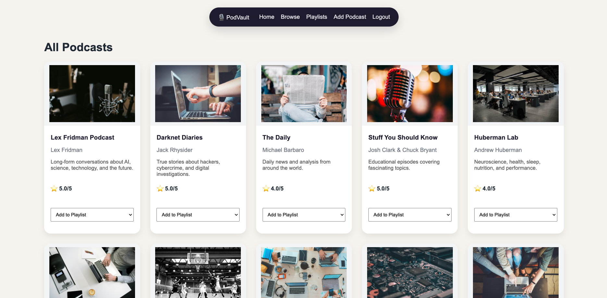

# 🎙 PodVault

PodVault is a full-stack Django web application that allows users to discover, review, and organize their favorite podcasts in one place.

Users can create accounts, browse podcasts, write reviews, build personal playlists, and manage their own content through a secure authentication and authorization system.

---

# 📸 Screenshot

---

# 🚀 Live Application

[PodVault Live Application](https://podvault-2f36fbfbdb1a.herokuapp.com/)

---

# 📋 Planning Materials

- Trello:
  https://trello.com/b/GrnrEK2L/cinelog

---

# ✨ Features

- User authentication (Sign up, Login, Logout)
- Full CRUD functionality for Podcasts
- Full CRUD functionality for Reviews
- Full CRUD functionality for Playlists
- Add and remove podcasts from playlists
- Many-to-Many relationship between Podcasts and Playlists
- Authorization so users can only edit and delete their own content
- Responsive layout
- PostgreSQL database
- Deployed on Heroku

---

# 🛠 Technologies Used

- Python
- Django
- PostgreSQL
- HTML5
- CSS3
- GitHub
- Heroku

---

# 📂 Entity Relationship

The application includes the following models:

- User
- Podcast
- Review
- Playlist

Relationships:

- A User can create many Podcasts.
- A User can create many Reviews.
- A User can create many Playlists.
- A Podcast can have many Reviews.
- A Playlist can contain many Podcasts.
- A Podcast can belong to many Playlists.

---

# 📖 Getting Started

1. Sign up or log in.
2. Browse available podcasts.
3. View podcast details.
4. Leave reviews.
5. Create playlists.
6. Add podcasts to playlists.
7. Edit or delete your own content.

---

# 🙏 Attributions

- Unsplash (podcast placeholder images)
- Django Documentation
- Heroku Documentation

---

# 🔮 Future Enhancements

- Search podcasts
- Display star ratings instead of numbers
- Categories and filtering
- Favorite podcasts
- User profile pages
